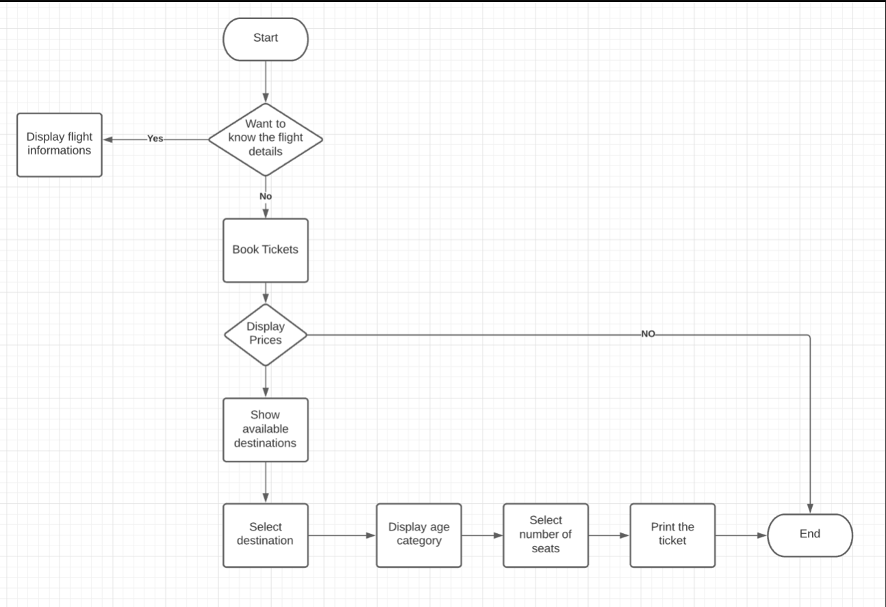

# Flight_Reservation_System

- With the modernisation, the flight culture is increasing day by day. Everyone prefers to go to and fro destinations in a flight rather than any other mode of transportation, Since it is the fastest mode of transportation at affordable rates. With the increase in the demand for the flight culture the possibility of the error and wastage of time also increases. Due to limited amount of seats available it leads to a lot of wastage of time. This has led to long queues and waiting time. In this project we are designing , developing and testing an assembly language code program to be used for a flight reservation generally referred as flight reservation system. This software is built on 8086 and hence it has very little to no need of specialised hardware and can perform tasks very quickly and accurately. Such a system is portable lightweight and easy to mass-produce thus having a huge scope in these modern times.

## Objective
- We are planning to successfully develop a working menu driven Flight Reservation System in emu8086. In this project, we are aiming to develop these modules:
- Display flight information.
- Book the flight tickets with user defined destination and age groups.
- Show the Total bill amount and ask the user for further ticket booking/exit the system.

## FlowChart

